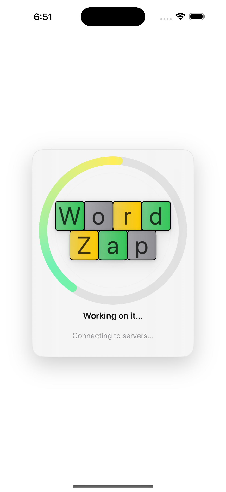
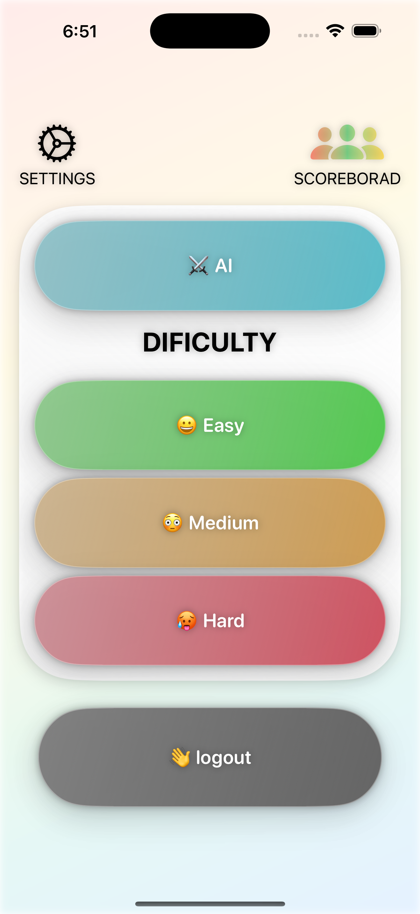
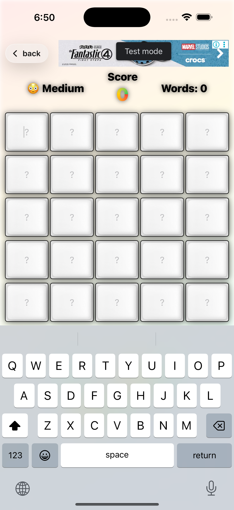

# WordZap

A fast, on‑device word puzzle for iOS with an AI opponent that **plays like Wordle**—no external APIs required. The AI proposes smart next guesses under the same green/yellow/gray rules you do, and it runs entirely with Core ML.

<p align="center">
  
</p>

---

## Highlights

- **Fun & familiar gameplay** – five‑letter guesses with green/yellow/gray feedback.
- **Smart AI** – `WordleAI` uses a decoder‑only Core ML model with:
  - KV prefill/stream decode (fast path) when both models are present.
  - Decoder‑only path (via `LLMService` → `KVTextDecoder`) when only a decoder is available.
  - Constraint‑aware sampling that respects greens, yellows, and letter counts.
- **Good openers by design** – Shannon‑entropy bias and heuristics reduce silly first guesses.
- **Multilingual** – English (`en`) and Hebrew (`he`) tags (`<|en|>`, `<|he|>`).
- **Private by default** – Everything runs on device; no network calls needed for gameplay.

---

## Screenshots

> Add your real screenshots to `README_assets/` and update the links.

<table>
<tr>
<td></td>
<td></td>
<td></td>
</tr>
</table>

---

## App Architecture

```
Word Zap
├─ App / UI
│  ├─ Game board, keyboard, history
│  └─ Difficulty & language pickers
├─ AI
│  ├─ WordleAI.swift           # Core AI (KV, fallback, constraints)
│  ├─ LLMService+WordleAI.swift# Thin service over decoder-only models
│  ├─ KVTextDecoder.swift      # Generic KV streaming wrapper for Core ML
│  ├─ BestGuessProducer.swift  # Combines human+AI history into best rows
│  └─ ModelStorage.swift       # Versioned storage for compiled models
└─ Resources
   └─ Tokenizer JSON/sidecars (auto-discovered)
```

### Key Modules

- **`WordleAI`**
  - Picks high‑entropy openers and generates next guesses via:
    - **KV path** (`prefill + decode`) if both models exist.
    - **Decoder‑only** path with sliding KV window.
    - **Single‑model fallback** (sliding window logits).
  - Enforces *greens / yellows / grays* and letter multiplicities.
  - Prefers sensible, non‑monotonic words, avoiding “qqqqq”‑style nonsense.

- **`KVTextDecoder`**
  - Probes model I/O to discover input names & shapes.
  - Maintains a rolling attention window with `present_* → past_*` updates.
  - Builds attention masks automatically (2D `[1,W]` and 3D `[1,1,W]` handled).

- **`BestGuessProducer`**
  - Merges player & AI histories and returns the **highest‑entropy rows**.
  - Correctly handles duplicate letters (e.g., one green `e` + additional yellow `e` if history proves it).
  - Dedupes rows and prevents illegal over‑use of letters.

- **`ModelStorage`**
  - Versioned app‑support directory: `Application Support/Models/v{version}/`
  - Helpers:
    - `modelExists(_ name:)`
    - `modelDir(name:)`
    - `cleanOldVersions(keepVersion:)`
  - Models are compiled (`.mlmodelc`) directories.

---

## Getting Started

### Requirements
- **Xcode 15+**
- **iOS 16+** (NE preferred; simulator is CPU-only)
- Swift 5.9+

### Build & Run
1. Clone the repo and open `WordZap.xcodeproj` (or workspace).
2. Select **iPhone** device (NE acceleration on real devices).
3. **Run**.

The app will boot with a safe default opener even if no model is present. To enable the AI model, follow the steps below.

---

## Adding the AI Model (Optional but recommended)

The AI expects a compiled decoder model (and optionally a prefill model).

### Option A — Use `ModelStorage` (recommended)
Place compiled models under:
```
Application Support/Models/v{AIPack.currentVersion}/
  ├─ WordleGPT_decode.mlmodelc/
  └─ WordleGPT_prefill.mlmodelc/   (optional, speeds up first token)
```

You can copy these during first launch, via a file import flow, or from a dev build script. Use:
```swift
try ModelStorage.modelDir(name: "WordleGPT_decode")
try ModelStorage.modelDir(name: "WordleGPT_prefill")
```
to get the exact target folders. `ModelStorage.modelExists(_:)` lets you gate UI if missing.

### Option B — Bundle for development
For quick prototyping, you can ship models inside the app bundle under:
```
Bundle/
  AI Model/
    WordleGPT_decode.mlmodelc/
    WordleGPT_prefill.mlmodelc/
```
The code will auto‑discover bundled models in that folder too, but **ModelStorage** wins if present.

### Tokenizer / Sidecar Files
`WordleAI` will look **near the model** and in common locations for:
- `tokenizer.json` (preferred)
- `tokenizer_config.json`, `special_tokens_map.json`, `tokenizer.model`, `config.json`
You can keep these **inside** `*.mlmodelc` directories or **next to** them. The finder checks:
- The model’s folder (since `*.mlmodelc` is a directory)
- Its parent directory
- `Application Support/AI Model/` and `Caches/AI Model/`
- Bundle root and `AI Model/` subdirectory

---

## Gameplay Notes

- **Opener policy**: favors high entropy and vowel coverage while avoiding alphabetical runs.
- **No “must be 5 unique letters” rule**: duplicates are allowed; they’re just **de‑prioritized** unless history suggests otherwise.
- **Constraint engine**: masks impossible letters/positions, respects minimum and maximum counts learned from history (e.g., when a letter is both gray and yellow in the same row, cap ≤ colored count).

---

## Troubleshooting

- **First decode step fails with shape mismatch (e.g., 84 vs 83)**  
  This indicates a model whose KV time dimension differs between prefill and decode. The code trims/alines K/V, but if you see crashes:
  - Ensure both `prefill` and `decode` were exported with matching sequence lengths.
  - Or run **decoder‑only** path (remove prefill) until you re‑export.

- **Silly first guess (e.g., “q” duplicates)**  
  Opener selection already biases away from monotonic/low‑entropy words and cools down repeated use via recency memory. If you still dislike a pick:
  - Lower the temperature or reduce `topK` in `AIDifficulty`.
  - Add domain bias in `openerBias(for:)` to prefer certain starts (e.g., vowel‑rich words).

- **Tokenizer not found**  
  Ensure `tokenizer.json` or one of the supported sidecars is present in the model folder or nearby locations listed above.

- **NE unavailable on Simulator**  
  Simulator uses CPU only. Test on a real device to get speed from the Neural Engine.

---

## Development

### Project Scripts / Tips
- **Warmup**: call `WordleAI.warmUp()` on first screen to avoid UI jank.
- **Model migration**: `ModelStorage.cleanOldVersions(keepVersion:)` deletes previous `vX/` directories on upgrade.

### Testing
- Unit test `BestGuessProducer` with histories that include:
  - Single/double letter proofs (`e` as green + yellow).
  - Gray+colored same row (cap enforcement).
  - Conflicting signals across rows (ban letters never colored).

---

## Roadmap

- In‑app model downloader with integrity checks.
- Word lists (optional) to validate final outputs for language packs.
- Tuning for additional languages.
- Share/replay puzzles.

---

## Privacy

Word Zap performs all AI inference **on‑device**. The app does not transmit guesses, solutions, or model inputs off the device.

---

## Contributing

PRs welcome! Please:
1. Open an issue describing the change.
2. Include repro steps and before/after behavior for AI‑facing tweaks.
3. Add tests when touching `BestGuessProducer` or constraint logic.

---

## License

Choose a license for your project (MIT/BSD/Apache‑2.0). Add the text to `LICENSE` at the repo root and update this section.

---

## Acknowledgments

- Core ML for on‑device inference.
- Everyone who enjoys a good five‑letter puzzle 🔤✨
